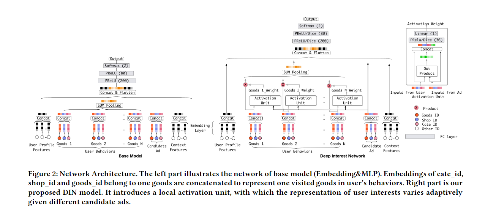

---
Type:
  - Paper
aliases: 
tags: 
论文链接: https://paperswithcode.com/paper/deep-interest-network-for-click-through-rate
modifiedDate: 星期一, 五月 26日 2025, 8:20:56 晚上
---

用于点击率预测的深度兴趣网络
Deep Interest Network for Click-Through Rate Prediction

## ABSTRACT 摘要

在工业领域应用中，比如线上广告，点击率预测是一个非常重要的任务。最近，基于深度学习的模型被提出了，且它们遵循着相似的嵌入与多层感知机（MLP）范式。在这些方法中，大规模稀疏输入特征首先被映射到低维嵌入向量中，然后以组为单位转换为固定长度的向量，最后被连接在一起并输入 MLP 来学习那些特征中非线性的关系。通过这种方式，用户特征被压缩为固定长度的表示向量，无论待选的广告是什么。这种使用固定长度的向量的方法会成为一个瓶颈，它使得嵌入和 MLP 方法难以有效的从用户丰富的历史行为中捕捉用户的兴趣。在本文中，我们提出了一个新颖的模型：深度兴趣网络（Deep Interest Network，DIN）。它通过设计一种能够自适应的从用户关于特定广告的历史行为中学习用户兴趣表示的局部激活单元。这种表示向量能够随着不同广告而相应变化，极大的提高了模型的表达能力。此外，我们研发了两种技术：小批量感知正则化和数据自适应激活函数，这些技术能够帮助训练具有数亿参数的工业深度网络。在两个公共数据集以及阿里巴巴超过 20 亿样本的真实生产数据集上的实验表明了所提出方法的有效性，且与最先进的方法相比，本方法取得了更优越的性能。DIN 现在已经成功的被部署在阿里巴巴的在线广告展示系统中，并服务于大部分的流量。

**CCS CONCEPTS 计算机科学领域概念** 信息系统->广告展示; 推荐系统

**KeyWords**  点击率预测，广告展示，电子商务

## 1 介绍

在每次点击成本（Cost-per-click，CPC）广告系统中，广告是通过有效每千次展示成本（effective cost per mille, eCPM）进行排名的，而 eCPM 是出价价格和点击率（click-through rate, CTR）的乘积，CTR 需要由系统预测。因此，CTR 预测模型的性能对最终的收入有直接影响，并在广告系统中起着关键作用。建模 CTR 预测已经受到了研究和工业界的广泛关注。

最近，受深度学习在计算机视觉和自然语言处理中的成功启发，一些基于深度学习的，针对 CTR 预测任务的方法被提出了。这些方法遵循着相似的嵌入与 MLP 范式：大规模稀疏输入特征首先被映射到低维嵌入向量中，然后以组为单位转换为固定长度的向量，最后被连接在一起并输入全连接层（也称为多层感知机，MLP）中来学习那些特征中非线性的关系。相比于常用的逻辑回归模型，这些深度学习方法可以减少大量的特征工程工作，并能大大提高模型的性能。简单起见，在本文中我们将这些已经在 CTR 预测任务中变得流行的方法称为 Embedding&MLP。

然而，Embedding&MLP 中有限维度的用户表示向量将成为表达用户多样化兴趣的瓶颈。以电子商务网站中的广告展示为例。用户在浏览电子商务网站时可能同时对不同种类的商品感兴趣。也就是说，用户的兴趣是**多样**的。在 CTR 预测任务中，用户的兴趣通常捕获自用户的行为数据。Embedding&MLP 方法通过将用户行为的嵌入向量转换为固定长度的向量来学习某个用户的所有兴趣的表示，该向量位于所有用户表示向量所在的欧氏空间中。换句话说，用户的不同兴趣被压缩到一个固定长度的向量中，这限制了 Embedding&MLP 方法的表达能力。为了使表示具有足够的能力来表示用户的不同兴趣，固定长度向量的维度需要被极大的扩展。不幸的是，这种做法会显著扩大学习参数量并且加剧在有限数据下过拟合的分线。此外，它还增加了计算和存储的负担，而这对工业在线系统是不能容忍的。

另一方面，在预测候选广告时没有必要将某个用户的所有不同兴趣都压缩到同一个向量中，因为只有用户的部分兴趣会影响它的行为（点击或不点击）。例如，一位女游泳运动员会点击一个被推荐的护目镜，主要是因为购买了泳衣，而不是在她上周购物清单中的鞋子。受此启发，我们提出了一个新颖的模型：Deep Interest Network（DIN，深度兴趣网络），该模型通过考虑历史行为与给定候选广告的相关性，来自适应的计算用户兴趣的表示向量。通过引入一个局部兴趣单元，针对候选广告，DIN 通过软搜索相关的部分历史行为，关注与此有关用户兴趣，并采用加权求和池化的方式来获取用户兴趣表示。与候选广告相关性较高的行为将获得更高的激活权重并主导用户兴趣表示。我们在实验部分可视化了这种现象。通过这种方法，用户兴趣表示向量将随着不同的广告而改变，这提高了模型在有限维度下的表达能力，且使 DIN 能够更好的捕捉用户的多样化兴趣。

训练具有大规模稀疏特征的工业深度网络是一项巨大的挑战。例如，基于 SGD 的优化方法只更新那些出现在每一个小批次中的稀疏特征的参数。然而，加上传统的$\ell_2$正则化后，需要为每个小批次计算整个参数集（在我们的情况下，数量级达到数十亿）的 L2 范数，这样的计算量是不可接受的。在本文中，我们研发了一种新颖的小批量感知正则化方法，这种方法只会让哪些出现在每个小批量中的非零特征特征的参数参与到 L2 范数的计算中，使计算可以被接受。此外，我们设计了一种数据自适应激活函数，它通过自适应的调整激活函数的阈值点以适应输入数据的分布，泛化了常用的 PReLU 方法。这种方法被证明对于训练育有稀疏特征的工业网络是有帮助的。

本文的贡献总结如下：
- 我们组织除了使用固定长度的向量来表达用户多样化兴趣这种做法的局限性，并设计了一个新颖的深度兴趣网络（DIN）。DIN 引入了一种局部激活单元，能够自适应地从历史行为中学习针对特定广告的用户兴趣表示。DIN 可以显著提高模型的表达能力，并更好地捕捉用户兴趣的多样性特征。
- 我们开发了两种新技术来帮助训练工业深度网络：i) 一种小批量感知正则化器，它减小了在具有大量参数的深度网络上进行正则化计算的开销，且有助于避免过拟合，ii) 一种数据自适应激活函数，它通过考虑输入的分布来泛化 PReLU，并表现出良好的性能。
- 我们在公共和阿里巴巴的数据集上进行了广泛的实验。实验结果验证了所提出的 DIN 和训练技术的有效性。我们的代码 1 是公开可用的。我们所提出的方法已被部署在阿里巴巴的商业广告展示系统中，这是世界上最大的广告平台之一，并为业务带来了显著的改进。

在本文中，我们专注于在电子商务行业中广告展示场景下的 CTR 预测建模。这里所讨论的方法也可以应用于具有丰富用户行为的类似场景中，例如电子商务网站的个性化推荐、社交网络中的信息流排名等。本文的剩余部分的内容组织如下。我们在第 2 节讨论相关工作，并在第 3 节介绍电子商务网站广告展示系统中用户行为数据特征的背景。第 4 节和第 5 节详细描述了 DIN 模型的设计以及提出的两种训练技术。我们在第 6 节展示实验结果，并在第 7 节进行总结。

## 2 相关工作

CTR 预测模型的结构已经由浅层结构发展到深层结构。与此同时，CTR 模型中使用的样本数量和特征维度也变得越来越大。为了更好地提取特征关系以提高性能，一些工作开始关注模型结构的设计。

作为一项开创性的工作，NNLM 学习每个单词的分布式表示，旨在避免语言建模中的维度灾难。这种方法，通常被称为嵌入（embedding），启发了许多自然语言模型和需要处理大规模稀疏输入的 CTR 预测模型。

LS-PLM 和 FM 模型可以被视为一类具有一个隐藏层的网络，它们首先在稀疏输入上应用嵌入层，然后施加特别设计的目标拟合转换函数，以捕捉特征之间的组合关系。

Deep Crossing 、Wide & Deep Learning 和 YouTube Recommendation CTR model 通过用复杂的 MLP 网络替换转换函数，扩展了 LS-PLM 和 FM，极大地增强了模型的性能。PNN 尝试通过在嵌入层之后引入一个乘积层来捕捉高阶特征交互。DeepFM 在 Wide&Deep 中引入了因子分解机作为***“wide”*** 模块，而无需进行特征工程。总的来说，这些方法遵循了类似的模型结构，即结合了嵌入层（用于学习稀疏特征的密集表示）和 MLP（用于自动学习特征的组合关系）。这种 CTR 预测模型极大地减少了人工特征工程的工作量。我们的基础模型遵循这种模型结构。然而，在具有丰富用户行为的应用领域中，特征通常包含可变长度的 ID 列表，例如 YouTube 推荐系统中的搜索词列表或观看过的视频列表。这些模型通常通过求和/平均池化将相应的嵌入向量列表转换为固定长度的向量，这会导致信息的丢失。我们所提出的 DIN 通过对于给定广告自适应地学习表示向量来解决这个问题，提高了模型的表达能力。

注意力机制起源于神经机器翻译（NMT）领域。NMT 通过计算所有注释的加权和来获得预期的注释，并只关注与生成下一个目标词相关的信息。最近的一项工作，DeepIntent，在搜索广告的背景下应用了注意力机制。与 NMT 类似，他们使用 RNN 来建模文本，然后学习一个全局隐藏向量来帮助关注每个查询中的关键词汇。研究表明，使用注意力机制可以帮助捕捉查询或广告的主要意图。DIN 设计了一种局部激活单元来软搜索相关的用户行为，并进行加权求和池化，以获得针对给定广告的用户兴趣的自适应表示。与广告和用户之间没有交互的 DeepIntent 不同，用户表示向量因不同的广告而异。

## 3 背景

在电商网站，例如阿里巴巴，广告是理所应当的商品。在本文的其余部分，除非特别声明，我们将广告视为商品。图 1 简单展示了阿里巴巴广告展示系统的运行流程，它主要由两个主要阶段组成：i）匹配阶段，该阶段通过协同过滤等方法生成与访问用户相关的候选广告列表；ii）排名阶段，该阶段预测每个给定广告的点击率，然后选择排名最高的广告。在每一天，都有数以亿计的用户访问电商网站，给我们留下了在构建匹配和排名模型中起着关键作用的大量用户行为数据。值得一提的是，具有丰富历史行为的用户拥有多样化的兴趣。例如，一位年轻母亲最近浏览了包括羊毛大衣、T 恤、耳环、手提包、皮包和儿童大衣在内的商品。这些行为数据为我们提供了她购物兴趣的线索。当她访问电子商务网站时，系统会向她展示合适的广告，例如一款新的手提包。显然，展示的广告只匹配或激活了这位母亲的部分兴趣。总之，具有丰富行为的用户的兴趣是多样化的，并且在给定某些广告的情况下可以被局部激活。我们将在本文后面展示充分利用这些特点在构建 CTR 预测模型中的起到的重要作用。

## 4 深度兴趣网络（DEEP INTEREST NETWORK，DIN）

与赞助搜索不同，用户在进入广告展示系统时并不伴随着被明确表达的的倾向。在构建 CTR 预测模型时，需要高效的方法来从丰富的历史行为中提取用户的兴趣。描述用户和广告的特征是广告系统中 CTR 建模的基本元素。合理地利用这些特征并从中挖掘信息是至关重要的。

### 4.1 特征表示

在工业点击率（CTR）预测任务中，数据大多数以多组分类形式出现，例如：[weekday=Friday, gender=Female, visited_cate_ids={Bag, Book}, ad_cate_id=Book]，通常通过编码转换为高维稀疏的二进制特征。在数学上，第$i$个特征组的编码向量被公式化为 $t_i \in R^{K_i}$。其中 $K_i$ 表示第$i$个特征组的维度，意味着第$i$个特征组包含 $K_i$ 个唯一的标识符。$t_i[j]$ 是向量 $t_i$ 的第 $j$ 个元素，且 $t_i[j] \in \{0, 1\}$。$\sum_{j=1}^{K_i} t_i[j] = k$。对于 $t_i$，当 $k = 1$ 时，指的是独热编码，当 $k > 1$ 时，指的是多热编码。然后，一个实例可以以组别方式表示为 $x = [t_1^T, t_2^T, ..., t_M^T]^T$，其中 $M$ 是特征组的数量， $\sum_{i=1}^{M} K_i = K$，$K$ 是整个特征空间的维度。

通过这种方式，上述具有四组特征的实例可以被表示为：

我们的系统中使用的全部特征集在表 1 中进行了描述。它由四类组成，其中用户行为特征通常是多热编码向量，并包含丰富的用户兴趣信息。请注意，在本设置中没有组合特征。我们使用深度神经网络捕获特征之间的交互作用。

### 4.2 基础模型（Embedding&MLP）

大多数流行的模型结构共享一个类似的 Embedding&MLP 范式，我们将这种结构称为基模型，如图 2 左侧所示，他由几部分组成：

**嵌入层**。由于输入是高维二进制向量，嵌入层被用于将它们转换为低维密集表示。对于第$i$个特征组的$t_i$，让$W^i = [w_{1}^{i}, ...,w_{j}^{i}, w_{k_{i}}^{i}]\in \mathbb{R}^{D *K_i}$表示第$i$个嵌入字典。其中$w_{j}^i \in \mathbb{R}^D$是一个嵌入向量，其维度为$D$。嵌入操作遵循如图 2 所示的表查找机制。
- 如果$t_i$是独热向量，其中第$j$个元素$t_{i}[j] = 1$，则$t_i$的嵌入表示是一个单一的嵌入向量$e_i = w_{ij}$。 
- 如果$t_i$是多热向量，其中对于$j \in \{i_1, i_2, ..., i_k\}$，$t_{i}[j] = 1$，则$t_i$的嵌入表示是一个嵌入向量的列表：$(e_{i_1}, e_{i_2}, ..., e_{i_k}) = (w_{i_1}^i, w_{i_2}^i, ..., w_{i_k}^i)$。

**池化层和连接层**。注意到不同的用户具有不同数量的行为，因此，多热行为特征向量 $t_i$ 的非零值数量在不同实例中是不同的。这导致相应嵌入向量列表的长度可变。由于全连接网络只能处理固定长度的输入，通过池化层将嵌入向量列表转换为固定长度向量是一种常见做法：

$$
 
e_i=\mathrm{pooling}(e_{i_1},e_{i_2},...e_{i_k}) \tag{1}
$$

两种最常用的池化层是求和池化（sum pooling）和平均池化（average pooling），它们对嵌入向量列表应用逐元素的求和/平均操作。
嵌入层和池化层都以组别方式操作，将原始的稀疏特征映射到多个固定长度的表示向量。然后，将所有向量连接在一起以获得实例的整体表示向量。

多层感知器（MLP）。给定连接后的密集表示向量，使用全连接层自动学习特征的组合。最近开发的一些方法专注于设计 MLP 的结构以更好的提取信息。

损失函数（Loss）基模型中使用的目标函数是负对数似然函数，其被定义为

$$
L=-\frac{1}{N} \sum_{(x, y) \in \mathcal{S}}(y \log p(x)+(1-y) \log (1-p(x)))
$$

其中 $\mathcal{S}$ 是大小为 $\mathcal{N}$ 的训练集，$x$ 是网络的输入，$y \in\{0,1\}$是标签，$p(x)$是经过 softmax 层后网络的输出，表示样本$x$被点击的预测概率。

### 4.3 DIN 的结构

在表 1 的所有特征中，用户行为特征至关重要，在电子商务应用场景中，对建模用户兴趣起着关键作用。
如方程（1）所示，基模型通过池化用户行为特征组的所有嵌入向量来获得固定长度的用户兴趣表示向量。对于给定的用户，这个表示向量是不变的，与候选广告是什么无关。这样，具有有限维度的用户表示向量将成为表示用户多样化兴趣的瓶颈。如果要使其具有足够表达能力，一个简单的方法是扩展嵌入向量的维度。但不幸的是，这将大幅增加学习参数。这将导致在有限的训练数据下过拟合的可能性，并增加计算和存储的负担，这对于工业在线系统来说是不可接受的。

在有限的维度下，有没有一种优雅的方式来在一个向量中表达用户的多样化兴趣？用户兴趣的局部激活特性启发了我们设计一个名为深度兴趣网络（DIN）的新颖模型。想象一下，上面第 3 节提到的年轻母亲在访问电子商务网站时，她发现展示的新手提包很可爱并点击了它。让我们剖析点击动作的驱动力。展示的广告通过软搜索她的历史行为并发现她最近浏览了类似的手提包和皮包，从而触及了这位年轻母亲的相关兴趣。换句话说，与展示的广告相关的行为大大促成了点击动作。DIN 通过关注对于给定广告的局部激活兴趣表示来模拟这一过程。DIN 不是用相同的向量来表达所有用户的多样化的兴趣，而是通过考虑历史行为与候选广告的相关性来自适应性地计算用户兴趣的表示向量。这个表示向量随着不同的广告而变化。
图 2 的右侧展示了 DIN 的架构。与基模型相比，DIN 引入了一个新颖设计的局部激活单元，并保持其他结构不变。具体而言，激活单元被应用于用户行为特征上，充当加权和池化的功能，以自适应地计算在给定候选广告 A 时的用户表示$vU$，如方程 (3) 所示。

其中$\{e_1, e_2, ..., e_H\}$是用户 U 的行为嵌入向量列表，长度为 H，$v_A$是广告 A 的嵌入向量。通过这种方式，$v_{U}(A)$随着不同的广告而变化。如图 2 所示，$a(⋅)$ 是一个前馈网络，其输出为激活权重。除了两个输入嵌入向量之外，$a(⋅)$ 还将它们的作为有助于相关性建模的显式知识的外积添加到后续网络中。

方程(3) 中的局部激活单元与在神经机器翻译（NMT）任务中发展起来的注意力方法有相似的思想。然而，与传统的注意力方法不同，在方程 (3) 中放宽了$\sum_i w_i = 1$的约束，目的是保留用户兴趣的强度。也就是说，放弃了对 $a(\cdot)$ 的输出进行 softmax 归一化。取而代之的是，$\sum_i w_i$的值在某种程度上被视为激活的用户兴趣强度的近似。例如，如果一个用户的历史行为包含 90%的服装和 10%的电子产品。在给定 T 恤和手机两个候选广告的情况下，T 恤激活了大多数属于服装的历史行为，并相比于手机可能会获得更大的 $vU$值（兴趣强度更高）。传统注意力方法通过归一化 $a(\cdot)$的输出，失去了$vU$数值尺度上的分辨率。

## 5 训练技术

在阿里巴巴的广告系统中，商品和用户的数量达到了上亿。实践中，训练具有大规模稀疏输入特征的工业深度网络是一个巨大的挑战。在这一节中，我们介绍了两种在实践中被证明是有帮助的重要技术。

### 5.1 小批量感知正则化

过拟合是训练工业网络时的一个关键挑战。例如，在添加细粒度特征后，比如具有 6 亿维度的 *good_ids* 特征（如表 1 中描述的，包括用户的 *visited_goods_ids* 和广告的 *good_ids*），如果不使用正则化，在训练过程中，模型性能在第一个 Epoch 后会迅速下降，如图6.5中深绿色线所示。在训练具有稀疏输入和数亿参数的网络时直接应用传统的正则化方法，如$\ell_2$和$\ell_1$ 正则化，是不切实际的。以$\ell_2$正则化为例，在没有正则化的基于SGD的优化方法中，只有那些出现在每个小批量中的非零稀疏特征的参数需要被更新。然而，在增加$\ell2$正则化后，它需要对每个小批量的所有参数计算L2范数，这导致计算量极大，并且当参数数量增加到数亿时这是不可接受的。

在本文中，我们介绍了一种高效的小批量感知正则化器，它只计算在每个小批量中都出现的稀疏特征的参数的L2范数，使计算成为可能。事实上，是嵌入字典贡献了CTR网络中大部分的参数，并导致了繁重的计算难题。令 $\mathbf{W} \in \mathbb{R}^{D \times K}$ 表示整个嵌入字典的参数，其中 $D$ 是嵌入向量的维度，$K$ 是特征空间的维度。展开对样本的 $\ell_2$ 正则化在 $\mathrm{W}$ 上。

其中，$\boldsymbol{w}_j \in \mathbb{R}^D$ 是第 $j$ 个嵌入向量，$I\left(\boldsymbol{x}_j \neq 0\right)$ 表示实例 $\boldsymbol{x}$ 是否具有特征id $j$，$n_j$ 表示特征id $j$ 在所有样本中的出现次数。方程(4) 可以通过小批量感知方式转换为方程(5)

其中 $B$ 表示小批量的数量，$\mathcal{B}_m$ 表示第 $m$ 个小批量。令 $\alpha_{m j}=\max _{(x, y) \in \mathcal{B}_m} I\left(\boldsymbol{x}_j \neq 0\right)$ 表示在小批量 $\mathcal{B}_m$ 中是否至少有一个实例具有特征id $j$。然后方程(5) 可以近似为

通过这种方式，我们推导出 $\ell_2$ 正则化的近似小批量感知版本。对于第 $m$ 个小批量，关于特征 $j$ 的嵌入权重的梯度为

其中只有在第 $m$ 个小批量中出现的特征的参数参与正则化的计算。

### 5.2 数据自适应激活函数

PReLU 是一个被广泛使用的激活函数

其中，$s$ 是激活函数 $f(\cdot)$ 的输入维度之一，$p(s)=I(s>0)$ 是一个指示函数，控制 $f(s)$ 在两个通道之间切换，分别是 $f(s)=s$ 和 $f(s)=\alpha s$。在第二个通道中，$\alpha$ 是一个学习参数。这里我们称 $p(s)$ 为控制函数。图3的左部分绘制了PReLU的控制函数。PReLU在值为0的地方采取了硬性修正，这可能在每层的输入遵循不同的分布时不太合适。考虑到这一点，我们设计了一种新颖的数据自适应激活函数，命名为Dice，

其控制函数绘制在图3的右部分。在训练阶段，$E[s]$ 和 $\operatorname{Var}[s]$ 是每个小批量输入的均值和方差。在测试阶段，$E[s]$ 和 $\operatorname{Var}[s]$ 是通过数据的移动平均值计算得出的。$\epsilon$ 是一个小常数，在我们的实践中设为 $10^{-8}$。

Dice 可以被视为 PReLU 的一种归纳。Dice 的关键思想是根据输入数据的分布自适应调整修正点，其值设置为输入的均值。此外，Dice 通过平滑地控制来在两个通道之间进行切换。当 $E(s) = 0$ 且 $\operatorname{Var}[s] = 0$ 时，Dice 退化为 PReLU。
