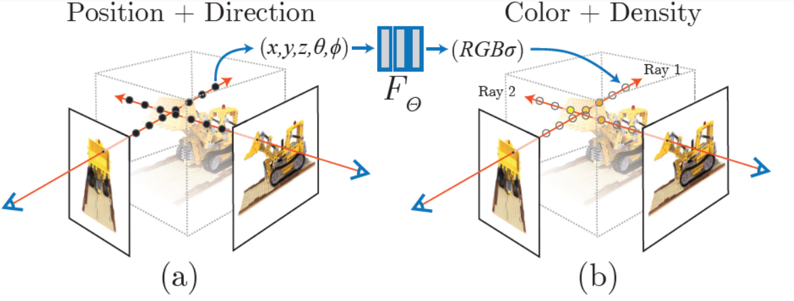

---
Type:
  - Page
aliases:
  - 神经辐射场
  - Neural Radiance Fields
Status: 
tags: 
modifiedDate: 星期一, 五月 26日 2025, 8:24:17 晚上
---

## 概览

### 目的与作用

三维重建
用一个MLP（全连层而非卷积，加上激活层）神经网络去隐式地学习一个静态3D场景，实现复杂场景的任意新视角合成（渲染）

## 原理

NeRF学习一个神经网络来表示三维场景，并使用体渲染技术生成逼真的图像，从而实现高质量的三维重建和新视角图像生成。
- 训练
    - 输入
        - 同一场景下一组2d图片
        - 图片对应的相机参数和位置
    - 用MLP代替辐射场
        - MLP将三维坐标和视角方向作为输入，输出该点在该方向上的颜色和密度。
    - **体渲染过程**：
        - 对于每个训练图像，从相机位置沿着每条射线采样多个三维点。
        - 将这些三维点的坐标和视角方向输入到MLP中，得到每个点的颜色和密度。
        - 使用体渲染方程，将这些点的颜色和密度沿射线进行积分，计算得到每条射线对应的像素颜色。
    - **损失计算**与反向传播：将体渲染得到的图像与实际输入的图像进行比较，计算两者之间的差异。通常使用均方误差（MSE）作为损失函数，即预测图像的像素颜色与实际图像的像素颜色之间的平方差之和。

个人认为需要大量的图片，各个方向都需要。
比如对于一条线上的点，如果只有一张图，那这条线上的颜色都是一样的。需要多张图片确定每一个点的颜色。
