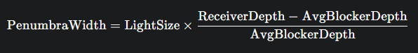

---
Type:
  - Page
aliases:
  - 百分比接近软阴影
  - percentage-closer soft shadows
tags: 
modifiedDate: 2025/06/25, 11:21:05
---

# PCSS

## 定义

对 [PCF](PCF.md) 的扩展, 改进, 它引入了**可变大小的半影**，从而模拟**接触硬化 (Contact Hardening)** 效果。其核心思想是：

- **遮挡物搜索 (Blocker Search)**：在 Shadow Map 中，对被着色像素点投影到的区域进行搜索，找到一个代表**平均遮挡物深度**的区域（通常是查找所有比当前像素更靠近光源的深度值的平均）。
- **计算半影大小 (Penumbra Size Calculation)**：根据光源的**近似尺寸**、平均遮挡物深度和当前像素深度，利用简单的几何公式计算出当前位置的**最佳 PCF 采样核大小**。
- **最终 PCF 过滤 (Final PCF Filtering)**：使用这个计算出的可变大小采样核，执行 PCF。

## 实现

- **遮挡物搜索 (Blocker Search)**：
    
    - **目的**：找到当前像素点在光源视锥体中**所有潜在遮挡物的平均深度**。
    - **方法**：对于主场景中的一个像素点 `P`，首先将其投影到光源的 Shadow Map 空间。然后，在这个 Shadow Map 投影点周围的一定区域内（通常是一个固定的搜索核，例如 3x3 或 5x5），采样多个深度值。
    - **关键**：只考虑那些比当前像素点**更靠近光源**的深度值（即真正的遮挡物）。然后计算这些遮挡物深度的**平均值**。
    - **输出**：`avg_blocker_depth`（平均遮挡物深度）。
- **半影大小计算 (Penumbra Size Estimation)**：
  
    - **目的**：利用几何学原理（相似三角形），根据光源尺寸、平均遮挡物深度和接收面深度来估算当前位置的半影宽度。
    - **变量**：
        - `light_size`：光源的近似尺寸（这是一个用户定义的参数，或根据光源类型和大小估算）。
        - `receiver_depth`：当前被着色像素点在光源空间的深度。
        - `avg_blocker_depth`：上一步计算出的平均遮挡物深度。
    - **公式（简化版，基于相似三角形）**： 半影大小
        - 这个公式的关键洞察是：**(`receiver_depth` - `avg_blocker_depth`)** 代表了遮挡物和接收面之间的距离。这个距离越大，阴影应该越柔和。
        - **`avg_blocker_depth`** 越小，说明遮挡物离光源越近，阴影也应越柔和（因为光源的视角度大）。
    - **输出**：`penumbra_width`（计算出的半影宽度），这个宽度将决定最终 PCF 的采样核大小。
- **最终 PCF 过滤 (Final PCF Filtering)**：
    - **目的**：使用上一步计算出的**可变大小的半影宽度**作为采样半径，执行 PCF。
    - **方法**：与标准 PCF 类似，但在 Shadow Map 中采样的核大小是动态调整的。根据 `penumbra_width`，确定一个合适的采样核（例如，更大的 `penumbra_width` 意味着更大的采样半径和更多的采样点）。对这些采样点执行二元可见性测试，然后取平均值。

## 优点

- **真实感强**：模拟了[接触硬化](接触硬化.md)，阴影的柔和度随距离动态变化，视觉效果更佳。
- **物理可信度高**：基于几何学原理。

## 问题

- **性能开销高**:  PCSS 比标准 PCF 慢很多，尤其在复杂的场景中，这可能是主要瓶颈。
    - **遮挡物搜索**：相比于 PCF, 需要一个额外的、通常是固定大小的采样步骤（遮挡物搜索）, 而纹理采样是十分昂贵的. [^1]
    - **动态采样核**：相邻的像素很有可能拥有不同的采样盒大小, 这影响了一个 warp 的并行性. 降低了 GPU 的利用率

### 优化加速

#### 优化采样模式 (反走样)

- 抖动采样
- 泊松圆盘采样

#### 查找表

对于静态场景, 预计算半影大小计算公式的部分或全部结果，存储在纹理中。在运行时通过纹理查找来获取值，避免重复计算。

[^1]: 着色器中最慢的就是纹理采样, 需要几十个时钟周期
