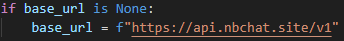

---
Type:
  - Page
aliases: 
Status: 
tags:
  - 经验
modifiedDate: 星期一, 五月 26日 2025, 8:23:33 晚上
---
[本科毕业设计](本科毕业设计.md)
[本科毕设数据增强记录](本科毕设数据增强记录.md)

## Openai Api域名更换

比如我购买了[NBchat API](https://api.nbchat.site/panel/profile)的中转api，需要更换域名
可以在
`~/.conda/envs/ONCE/lib/python3.9/site-packages/openai/_client.py`中

把`base_url` 从默认改为 `https://api.nbchat.site/v1`即可
或者
`client = OpenAI( api_key=keys,base_url='https://api.nbchat.site/v1' )`
