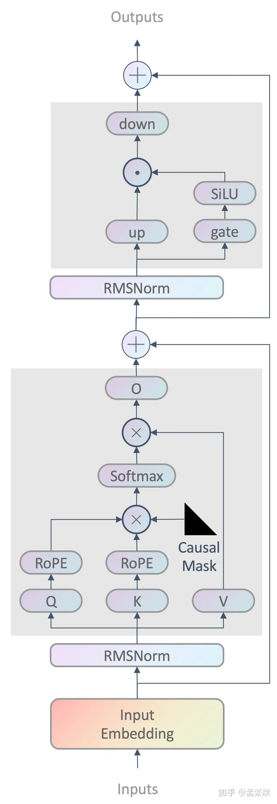
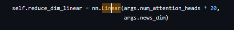
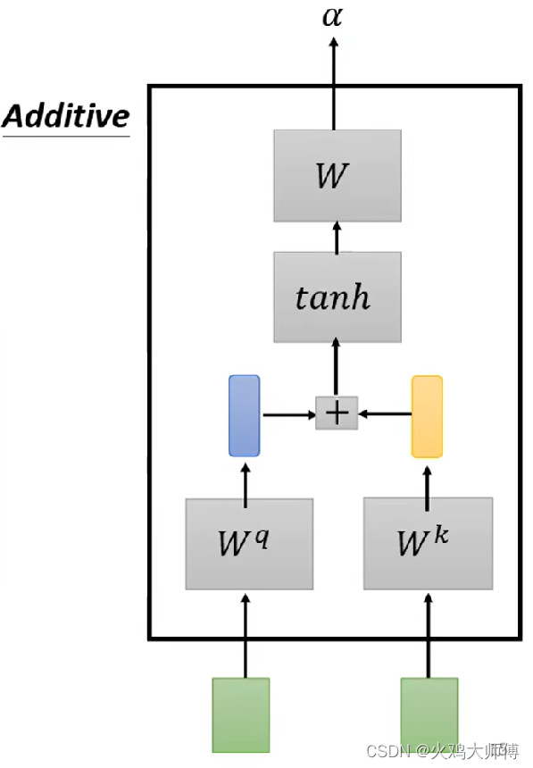
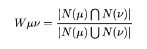
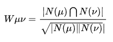
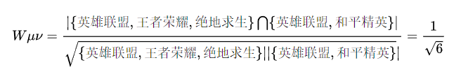
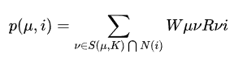

---
Type:
  - Page
aliases: 
Status:
tags: 
modifiedDate: 星期一, 五月 26日 2025, 8:27:35 晚上
---
[本科毕业设计](本科毕业设计.md)

```dataview
list
filter(file.outlinks, (x)=>!contains(string(x),"assets"))
FROM ""
where contains(file.name,this.file.name)
```

[本科毕业设计](本科毕业设计.md)

## Llama

### 文件作用

[mindformers/models/llama · MindSpore/mindformers - 码云 - 开源中国 (gitee.com)](https://gitee.com/mindspore/mindformers/tree/dev/mindformers/models/llama)

```
llama
    ├── __init__.py
    ├── convert_weight.py         # 权重转换脚本
    ├── llama.py                  # 模型实现
    ├── llama_config.py           # 模型配置项
    ├── llama_layer.py            # llama网络层定义
    ├── llama_processor.py        # llama预处理
    ├── llama_tokenizer.py        # tokenizer
    └── llama_transformer.py      # transformer层实现
```

#### llama.py

##### `def layer_compute_dtype`

设置并行处理中的数据类型

> [!NOTE]-  
> 这段代码定义了一个名为 `layer_compute_dtype` 的函数，它用于计算并设置神经网络中每一层的数据类型。这个函数接收五个参数：`layer`，`layer_id`，`offset`，`parallel_config` 和 `n_layers`。
> 
> 首先，函数计算了`pp_dis`，这是一个表示并行处理的阶段数的值。然后，它检查`offset`的类型。如果`offset`是一个列表，那么它会检查列表的长度是否与`pipeline_stage`相等。如果不等，它会抛出一个`ValueError`。如果`offset`是一个整数，那么它会直接被赋值给`offset_layer`。如果`offset`既不是列表也不是整数，那么它会抛出一个`TypeError`。
> 
> 接下来，函数计算`pp_id`，这是一个表示当前层在并行处理阶段中的位置的值。然后，它将`pp_id`赋值给`layer.pipeline_stage`。
> 
> 然后，函数计算`dis`，这是一个表示梯度聚合组的数量的值。如果`pipeline_stage`大于1，那么它会调用`layer.set_comm_fusion(2)`。否则，它会调用`layer.set_comm_fusion(int((layer_id + offset_layer) / dis) + 1)`。
> 
> 最后，函数检查`parallel_config.recompute`的类型。如果它是一个布尔值，那么如果它为真并且`select_recompute`为假，那么它会调用`layer.recompute()`。如果`parallel_config.recompute`不是一个布尔值，那么如果`parallel_config.recompute.recompute`为真并且`select_recompute`为假，那么它会调用`layer.recompute(recompute_slice_activation=parallel_config.recompute.recompute_slice_activation)`。

总的来说，这个函数的目的是根据输入的参数来设置神经网络中每一层的数据类型和并行处理的阶段。

##### `LlamaModel`

模型具体构建

#### llama_transformer.py

##### `LLamaAttention`

这里基本上和原始 attention 一样，区别在于使用了 Rope 旋转位置编码。  
softmax 处使用的是 float32编码

##### `LlamaDecodeLayer`

这里流程是先进行 LayerNorm--->使用 `LlamaRMSNorm` 函数  
接着进行 attention--->使用 `LlamaAttention`  
原始输入+attention输出=输出1  
进行 LayerNorm--->使用 `LlamaRMSNorm` 函数  
进行全连接操作--->LlamaMLP(多层感知机) 这里是 `LlamaFeedForward`  
输出1+MLP输出=输出2  
这里和原始transformers的decoder区别是在输入进行LayerNorm操作。



#### llama_layer.py

##### `LlamaFeedForward`

MLP 多层感知机  
全连接

这里用了3个线性层和一个激活函数 act，线性层分别是 gate_proj(G)，up_proj(U)，down_proj(D)，维度分别是[h,i],[h,i],[i,h]，均无 bias，计算方式为 D(act(GX) * UX)

这里区别于原始transformers的mlp，原始是由两个线性层组成，第一个线性层先将维度映射为4h维，第二个线性层再映射回h维，接着进行激活函数操作。而llama则是将原有4h变成一个常量作为输入，且计算方式也略有不同。这里猜想是因为原先h不算大，所以4h也在一个接受的范围，但是随着大模型h参数的增大，4h也会呈线性增加，所以这里设了一个常量。

##### `LlamaSiLU`

激活函数 SiLU 实现

##### `FreqsMgr`

位置编码 频率计算？

##### `LlamaRotaryEmbedding`

旋转位置编码的主要实现 ^990869

##### `LlamaEmbedding`

编码层

##### `LlamaRMSNorm`

RMS 标准化

##### `LlamaFeedForward`

MLP 多层感知机  
全连接

##### `CausalMask`

掩蔽

#### llama_processor.py

##### `LlamaProcessor`

可能是用于处理 Llama 模型的输入的  
分词等

---

## GENRE

提示闭源LLMs进行基于内容的推荐

### news_summarizer.py

生成内容摘要  
确定好提示词  
原格式：

```
title {title}
abstract {abstract}
category {category}
subcategory {subcategory}
```

要求的格式：

```
newtitle {newtitle}
```

整体流程如下

### user_profiler_mind.py

用户肖像（根据浏览记录预测用户兴趣和区域）

输入某个用户的浏览历史

```
(1) {news title}
...
(n) {news title}
```

输出该用户的区域和

```
[topics]
- topic1
- topic2
...
[region] (optional)
- region1
- region2
...
```

### personalized_news_generator.py

生成用户感兴趣的新闻  
输入一系列用户感兴趣的类别和标题

```
(1) (the category of the first news) the title of the first news
...
(n) (the category of the n-th news) the title of the n-th news
```

输出新的、用户可能感兴趣的新闻

```
{"title": <title>, "abstract": <news abstract>, "category": <news category>}
```

其它比如GoodReads大同小异

### Processor

prompter.py  
读取数据集，将其转化为需要的格式

> [!Note]-  
> 这段Python代码定义了一个名为`MindPrompter`的类，它可能是用于处理新闻数据的。
> 
> 在`__init__`方法中，它接受一个参数`data_path`，这是数据文件的路径。然后，它读取`data_path`指向的文件，并将其存储在`self.news_df`中。它还定义了一个字典`self.keys`，这个字典映射了新闻的各个属性到它们在数据文件中的列名。
> 
> `stringify`方法将`self.news_df`中的每一行转换为一个字符串，并将这些字符串存储在`self._news_list`中。字符串的格式是`[key] value`，其中`key`是新闻的属性，`value`是该属性的值。
> 
> `get_news_dict`方法将`self.news_df`中的每一行转换为一个字典项，并将这些字典项存储在`self._news_dict`中。字典的键是新闻的ID（'nid'），值是新闻的标题（'title'）。

---

## DIRE

### 模型结构

#### Embedding 嵌入层

**文本处理**  
在文本序列开头加入标签\<news article>在每个特征前加入标签\<feature\>以表示特征，随后使用通用api分词  
比如

>"news article:[title] Here's Exactly When To Cook Every Dish For anksgiving Dinner[abstract] Time out turkey day down to the minute.[category] foodanddrink"

**分词**tokenizer  
使用字节对编码（BPE）算法对数据进行分词，使用 SentencePiece 的实现。可调用api

**编码**  
[旋转位置编码](#^990869)

#### 解码层

就是Llama Decoder的序列

#### 注意力融合层

模型的最后一部分  
包括线性层和加性注意力机制两部分

##### 线性层

线性变换  
  
降维  


##### 加性注意力机制

示意图  
$z = 𝐴𝑡𝑡𝑒𝑛𝑡𝑖𝑜𝑛 (Z) ∈ R^𝑑$  
压缩特征，表示最后的向量（）  


```python
class AdditiveAttention(nn.Module):
	def __init__(self, embed_dim, hidden_size):
		super().__init__()

		self.embed_dim = embed_dim
		self.hidden_size = hidden_size

		self.encoder = nn.Sequential(
			nn.Linear(self.embed_dim, self.hidden_size),
			nn.Tanh(),
			nn.Linear(self.hidden_size, 1, bias=False),
		)

	def forward(self, inputs: torch.Tensor, attention_mask: torch.Tensor = None) -> [torch.Tensor, torch.Tensor]:
		"""

		@param inputs: [B, L, D]
		@param attention_mask: [B, L]
		@return: [B, D]
		"""

		attention = self.encoder(inputs).squeeze(-1)  # [B, L]
		if attention_mask is None:
			attention = torch.exp(attention)  # [B, L]
		else:
			attention = torch.exp(attention) * attention_mask  # [B, L]
		attention_weight = attention / (torch.sum(attention, dim=-1, keepdim=True) + torch.finfo(torch.float32).eps)  # [B, L]

		return torch.sum(inputs * attention_weight.unsqueeze(-1), dim=1)  # [B, D]
```

>[!note]-  
>这是一个实现加性注意力机制（Additive Attention）的 PyTorch 模块。以下是对代码的详细解释：
> 
> 1. `__init__` 方法：在初始化过程中，定义了模块的基本参数，包括输入嵌入维度 `embed_dim` 和隐藏层大小 `hidden_size`。然后，构建了一个简单的序列模型 `encoder`，该模型包括两个线性层和一个 Tanh 激活函数。第一个线性层将输入维度为 `embed_dim` 的张量映射到维度为 `hidden_size`，然后应用 Tanh 激活函数，最后通过第二个线性层将其映射到维度为 1，得到一个标量值。
> 
> 2. `forward` 方法：这是模块的前向传播函数。接收两个输入参数，`inputs` 和 `attention_mask`。`inputs` 是形状为 `[B, L, D]` 的输入张量，表示批次大小（B）、序列长度（L）和输入嵌入维度（D）。`attention_mask` 是一个可选的形状为 `[B, L]` 的注意力掩码。
> 
>    - `attention = self.encoder(inputs).squeeze(-1)`: 通过对输入 `inputs` 应用序列模型 `self.encoder` 得到一个形状为 `[B, L, 1]` 的张量，然后使用 `squeeze(-1)` 操作去除最后一个维度，得到形状为 `[B, L]` 的注意力张量。
> 
>    - 注意力权重计算：
>       - 如果 `attention_mask` 为 None，则应用指数函数，即 `attention = torch.exp(attention)`。
>       - 如果提供了 `attention_mask`，则将其与注意力张量相乘，即 `attention = torch.exp(attention) * attention_mask`。这是为了在计算注意力权重时应用掩码。
> 
>    - 计算注意力权重归一化：通过除以注意力张量的总和，并添加一个小的 epsilon 避免除零错误，得到形状为 `[B, L]` 的注意力权重 `attention_weight`。
> 
>    - 最终输出：使用注意力权重对输入序列 `inputs` 进行加权求和，得到形状为 `[B, D]` 的输出。这是通过 `torch.sum(inputs * attention_weight.unsqueeze(-1), dim=1)` 实现的，其中 `attention_weight.unsqueeze(-1)` 是为了与输入张量相乘时维度匹配。
> 
> 这个模块的主要目的是通过加权求和的方式，根据输入序列中不同位置的注意力权重来生成最终的输出。

总体来说，加性注意力机制通过学习权重来动态地关注输入的不同部分，以便更好地捕捉输入之间的关系。这种机制的优势在于可以处理不同长度的输入序列，并且具有较好的表达能力。

### 微调策略

#### 冻结和缓存

冻结低层，只微调最上面两层，从而减少计算量  
**缓存**  
缓存被冻结的层吗？

#### LORA微调

[一文读懂：详细解释LoRA微调原理（附手撸代码） - 知乎 (zhihu.com)](https://zhuanlan.zhihu.com/p/681502990)

### User Encoder

>[!note]-  
>加权聚合内容编码器生成的向量
> ```python
> class UserEncoder(torch.nn.Module):
>     def __init__(self, args):
>         super(UserEncoder, self).__init__()
>         self.args = args
>         self.news_additive_attention = AdditiveAttention(
>             args.news_dim, args.user_query_vector_dim)
>         if args.use_padded_news_embedding:
>             # self.news_padded_news_embedding = nn.Embedding(1, args.news_dim)
>             self.pad_doc = nn.Parameter(torch.empty(1, args.news_dim).uniform_(-1, 1)).Type(torch.FloatTensor)
>         else:
>             # self.news_padded_news_embedding = None
>             self.pad_doc = None
>         
> 
>     def _process_news(self, vec, mask, pad_doc,
>                     additive_attention, use_mask=False, 
>                     use_padded_embedding=False):
>         assert not (use_padded_embedding and use_mask), 'Conflicting config'
>         if use_padded_embedding:
>             # batch_size, maxlen, dim
>             batch_size = vec.shape[0]
>             padding_doc = pad_doc.expand(batch_size, self.args.news_dim).unsqueeze(1).expand( \
>                                          batch_size, self.args.user_log_length , self.args.news_dim)
>             # batch_size, maxlen, dim
>             vec = vec * mask.unsqueeze(2).expand(-1, -1, self.args.news_dim) + padding_doc * (1 - mask.unsqueeze(2).expand(-1, -1, self.args.news_dim))
>         # batch_size, news_dim
>         vec = additive_attention(vec,
>                                  mask if use_mask else None)
>         return vec
> 
>     
>     def forward(self, log_vec, log_mask):
>         """
>         Returns:
>             (shape) batch_size,  news_dim
>         """
>         # batch_size, news_dim
>         log_vec = self._process_news(log_vec, log_mask, self.pad_doc,
>                                      self.news_additive_attention, self.args.user_log_mask,
>                                      self.args.use_padded_news_embedding)
>         
>         user_log_vecs = log_vec
> 
> 
>         return user_log_vecs
> 
> ```

---

## 基于用户的协同过滤算法

**参考文章**：  
[基于用户的协同过滤算法（UserCF）原理以及代码实践 - 简书 (jianshu.com)](https://www.jianshu.com/p/7c5d9c008be9)

### 算法原理

**用户与用户之间的相似度**  
如果要给一个用户A推荐物品，可以先找到与A最为相似的用户B，接着获取用户B最喜欢的且用户A没有听说过的物品，并预测用户A对这些物品的评分，从中选取评分最高的若干个物品推荐给用户A。

#### 用户之间相似度计算

- Jaccard公式  
  
对于用户u和用户v，令N(u)代表用户u喜欢的物品合集，令N(v)代表用户v喜欢的物品合集。N(u)∩N(v)代表的是用户u和用户v都喜欢的物品，N(u)∪N(v)代表的是用户u和用户v喜欢的物品的合集

将用户u与用户v都喜欢的物品的数量除以他们喜欢物品的总和，如果u和v喜欢的物品是一模一样的，则u和v的相似度为1

- 余弦相似度  
    
  分母部分是u喜欢的物品的数量与v喜欢的物品的数量的乘积  
  

#### 用户对物品感兴趣程度

  
) 代表的是与用户最相似的K个用户，将与用户相似的用户列表按照相似度进行排序就可以得到。)代表的是对喜欢物品i的用户集合，代表的是用户和用户之间的相似度，这个也可以直接从用户相似度表中得到。代表用户v对物品i的兴趣，因为使用的是单一行为的隐反馈数据，所以所有的。

对于与用户最相似的K个用户，我们分别计算用户与这K个用户喜欢的物品集合之间的感兴趣程度，得到用户  
对这N个物品的感兴趣程度列表，然后将其逆序排序，取前m个物品推荐给用户

### 流程

1. 获取数据集，并筛选出合适部分
2. 建立User-Item表，即用户-物品列表，记录了每个用户喜爱的物品。 

| 用户  | 浏览过的新闻  |
| --- | ------- |
| A   | {a,b,d} |
| B   | {a,c,d} |
| C   | {b,e}   |
| D   | {c,d,e} |

^5c83b5

3. 建立倒排表，建立倒排表，即Item-User表。（只需要计算那些彼此之间有共同喜爱物品的用户之间的相似度）

| 新闻  | 浏览过的用户  |
| --- | ------- |
| a   | {A,B}   |
| b   | {A,C}   |
| c   | {B,D}   |
| d   | {A,B,D} |
| e   | {C,D}   |

4. 建立用户交集矩阵（用于计算用户间的相似性）

|     | A   | B   | C   | D   |
| --- | --- | --- | --- | --- |
| A   | 0   | 2   | 1   | 1   |
| B   | 2   | 0   | 0   | 2   |
| C   | 1   | 0   | 0   | 1   |
| D   | 1   | 2   | 1   | 0   |

5. 计算相似度矩阵

| |A|B|C|D|
|---|---|---|---|---|
|A|0|0.67|0.41|0.33|
|B|0.67|0|0|0.67|
|C|0.41|0|0|0.41|
|D|0.33|0.67|0.41|0|

6. 进行物品推荐

例如对C进行推荐  
由表可知，C和AD有相似  
查[User-Item表](#^5c83b5)，得到AD喜欢的物品，再减去C喜欢的物品最后得到待选物品{a,c,d}  
计算感兴趣程度

```
p(C,a) = W[C][A] = 0.41  
p(C,c) = W[C][D] = 0.41  
p(C,d) = W[C][A] + W[C][D] = 0.82
```

倒排得到推荐列表

### 流程总结

- 训练阶段
- 推荐阶段

对于训练阶段，可分为以下几步：

1. 数据预处理，建立User-Item表
2. 建立Item-User倒排表
3. 建立用户物品交集矩阵
4. 建立用户相似度矩阵

对于推荐阶段，可分为以下几步：

1. 寻找与被推荐用户最相似的K个用户
2. 计算用户对物品的感兴趣列表并逆序排列

线性流程，画不了流程图

## LLM用于内容编码器

### run.py

#### main()函数

``utils.setuplogger() ``设置日志（待了解）  
`args = parse_args()`参数解析，包括模型，权重位置，分词器位置等等

```python
if 'train' in args.mode:
    train(args)
if 'test' in args.mode:
    test(args)
```

模式选择

#### train()函数

```python
# Only support title Turing now
assert args.enable_hvd  # TODO
if args.enable_hvd:
    import horovod.torch as hvd

if args.load_ckpt_name is not None:
    #TODO: choose ckpt_path
    ckpt_path = utils.get_checkpoint(args.model_dir, args.load_ckpt_name)
else:
    ckpt_path = utils.latest_checkpoint(args.model_dir)


hvd_size, hvd_rank, hvd_local_rank = utils.init_hvd_cuda(
    args.enable_hvd, args.enable_gpu)
```

加载多卡训练框架，权重位置等等

```python
tokenizer = AutoTokenizer.from_pretrained("bert-base-uncased") #base指模型大小（层数），uncased指是否区分大小写
config = AutoConfig.from_pretrained("bert-base-uncased", output_hidden_states=True) # 输出隐藏层状态？
config.num_hidden_layers = 8 #默认12层？只使用8层？
bert_model = AutoModel.from_pretrained("bert-base-uncased",config=config) #加载模型
```

- 加载bert模型

```python
# freeze parameters 冻结不需要使用的参数
for name,param in bert_model.named_parameters():
    if name not in finetuneset:
        param.requires_grad = False
```

冻结不需要使用的参数

```python
news, news_index, category_dict, domain_dict, subcategory_dict = read_news_bert(
    os.path.join(args.root_data_dir,
                f'{args.dataset}/{args.train_dir}/news.tsv'), 
    args,
    tokenizer
)
```

读取数据集  
[read\_news\_bert()](read_news_bert().md)  
从字典与列表转为numpy数组（存储token等）以输入模型

```python
news_combined = np.concatenate([
    x for x in
    [news_title, news_title_type, news_title_attmask, \
        news_abstract, news_abstract_type, news_abstract_attmask, \
        news_body, news_body_type, news_body_attmask, \
        news_category, news_domain, news_subcategory]
    if x is not None], axis=1)
```

将新闻文章的不同部分（标题、摘要、正文、类别、域和子类别）连接成一个大的 NumPy 数组。

#### 模型

`model = ModelBert(args, bert_model, len(category_dict), len(domain_dict), len(subcategory_dict))`  
模型由news encoder和user_encoder、交叉熵损失函数组成  
输入 logid（用户历史浏览记录）到user_encoder得到用户向量  
news encoder输入input_ids（新闻） 得到新闻向量
