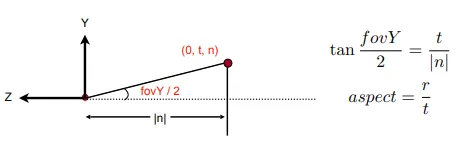
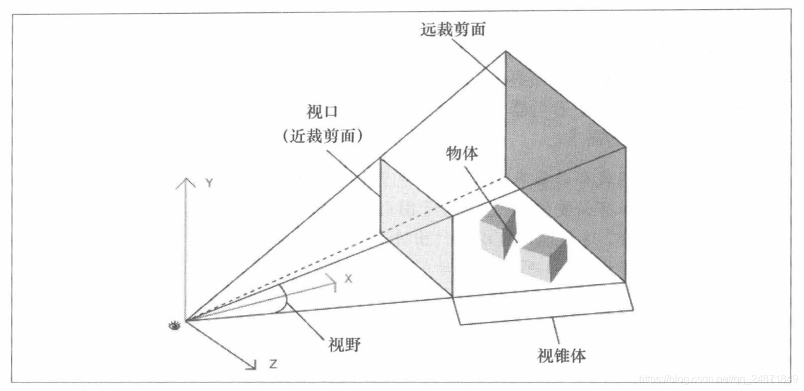
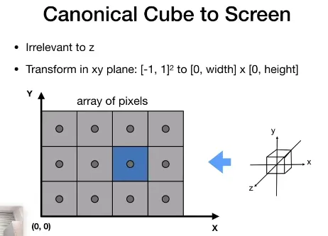
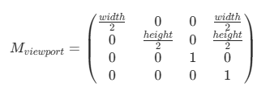
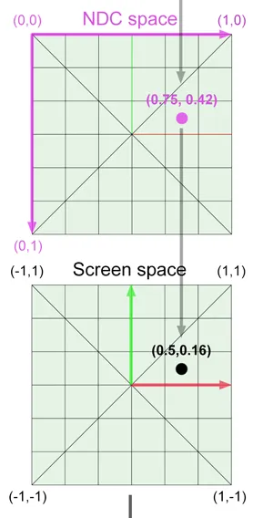

---
Type:
  - Page
aliases:
  - Rasterization
tags: 
Status: 
modifiedDate: 星期三, 六月 4日 2025, 4:05:37 下午
---

## 光栅化流程

1. 模型变换，把模型从模型空间转换到世界空间，即放入世界
2. 视图变换，将模型从世界空间转换到相机空间
3. 透视投影，把模型从相机空间转【-1,1】的立方体，注意，近平面的距离，长，宽等并不一定是1。可自主。
   可以用一个Y方向的垂直视场角（FOV）和一个长宽比（相当于x方向视场角）来确定两条边的比，距离，高度，宽度等。
   
   
   透视投影的前半矩阵把视锥压缩成（透视的）长方体(获取物体在视口上的位置)。后半正交投影把正方体转为标准立方体。
   前半矩阵获取物体在视口上的位置，后半则归一化为-1，1（NDC）
   
4. 视口变换（屏幕），把模型从立方体中变换到像素屏幕上。把【-1,1】立方体上的点转化（进行缩放和平移）成[0,width] X [0,height]（这个过程也称为视口变换）与z无关
   
   
    1. 对近裁剪面上的点，例如（0.5，0.5），转为NDC（0到1）坐标（0.75，0.25）
       
    2. 再把NDC坐标转为屏幕上像素位置，需要考虑，屏幕宽高，比如宽2000，长1000的屏幕NDC坐标（0.75，0.25）就对应（1500，250）

## 为什么模型用三角形？

- 最基本的几何平面；保证是平面；  
- 容易进行插值操作（重心坐标）  

2、怎么判断三角形和像素的关系？  

- 三边与点进行点积  

实际上就是用像素对图像进行采样，会出现锯齿（aliasing）。

解决方法：出现锯齿，进行反走样（antialiasing），先进行模糊操作再进行采样。

为什么模糊操作可以反走样？采样就相当于在时域用冲激函数对原函数做乘积，而采样频率越低，冲激函数频率越低，在频域的表现，冲激函数频率越高。而频域的原函数对冲激函数进行卷积操作，相当于对原函数图像的重复，冲激函数频率越高，越容易出现混叠。模糊操作消去了高频信号，高频信号便不容易混叠。

现实点的解决方法：

1、提高分辨率，就不关图形学的事儿了；

2、MSAA（multisampling AA)/超采样，把一个像素变成多个像素进行采样，得到的值求平均，还是用一个像素来表现，近似了模糊的操作，并没有提高分辨率，缺点是效率问题（问了老师，老师把antialising叫做反混淆，实际指的可能就是MSAA？）；

3、FXAA（fast approximate AA），图像处理层面，对生成的锯齿图去锯齿；

4、TAA（temporal AA），把MSAA对样本的处理分布在时间上。复用上一帧结果

5、超分辨率/超采样/DLSS（deap learning super sampling）

\*这一块的前提好像就是模型的复杂度/图像的分辨率足够，采样点不足。如果采样点足够多，就不会出现锯齿现象！

写完作业后来总结一波，这一章主要解决的就是**光栅化和反走样问题**，我之前一直对光栅化没有深入的了解，这次总算懂了一点点，首先就是在通过 [MVP](https://so.csdn.net/so/search?q=MVP&spm=1001.2101.3001.7020) 操作之后，我们得到一个标准立方体，**接下来需要进行视口变换，将标准立方体的x和y与屏幕坐标x和y对应（作业代码里已经写得很清楚了）**，然后就是真正进行**光栅化操作**，以每个三角形为单位，逐个进行绘制：**通过遍历图像上的像素点**（这里有一些加速处理，比如bouding box，扫描线等等），**然后判断像素点的中心点是否在三角形中**（叉乘判断，若三者叉乘符号相同，便是在内部），**若在三角形中，则首先需要对该像素进行深度测试，若该像素深度小于深度缓存的深度即表面通过深度测试，此时便对该像素进行着色，也就是给该像素赋予颜色值，如此往复，最终实现绘制**。若要使用反走样技术，比如MSAA，就通过超采样实现，但这会带了更多的开销，不同的反走样技术实现起来也不同。**解决了之前理论课一直没弄明白的点：先模糊再采样的本质是什么？即改变颜色再着色，而先采样再着色则是先着色再改变周围像素块的颜色。**
