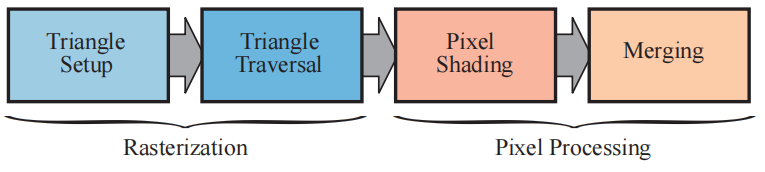

---
Type:
  - Page
aliases: 
tags: 
modifiedDate: 2025/06/19, 09:27:36
---

# 光栅化阶段

## 光栅化阶段

- 三角形设置 (triangle set up，也叫做图元装配，primitive assembly）
    - 计算三角形的**边界方程**, 梯度信息等用于三角形遍历的信息
- 三角形遍历
    - 逐个检查被三角形覆盖的像素，生成对应片元，
    - 三角形三个顶点的属性进行**插值** (透视正确) 来获得每个三角形片元的属性。
