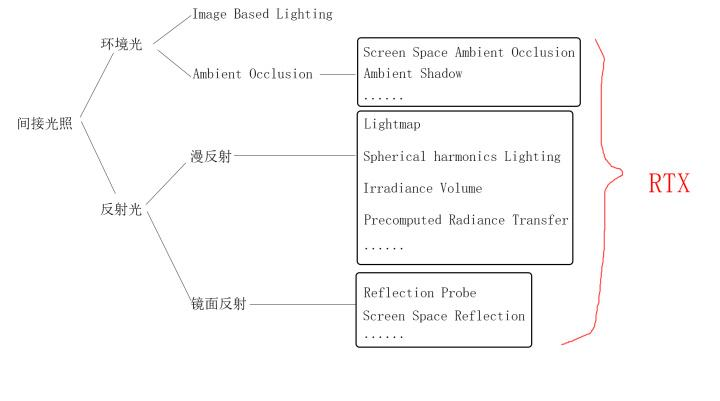

## 直接光

- 漫反射
- 镜面反射
- 阴影

## 间接光

- 反射光
    - 漫反射
        - [[Lightmap]]
        - [[光照探针]]
    - 镜面反射
        - [Unity Reflection Probe](Unity%20Reflection%20Probe.md)
        - [SSR](SSR.md)
- 环境光[^1]
    - [IBL](IBL.md)
    - [AO](AO.md)

[^1]: 指代来自四面八方的、无特定方向性的、相对均匀的光照。
