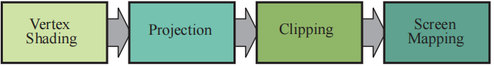
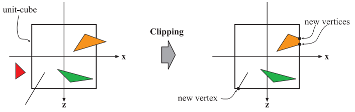
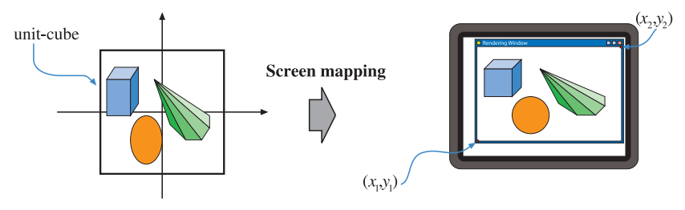

---
Type:
  - Page
aliases: 
tags: 
modifiedDate: 星期二, 六月 3日 2025, 10:27:03 晚上
---

可继续细分为四个阶段

## 顶点着色 (顶点处理的一部分)

- Vertex Shader
    - 顶点变换和任何**逐顶点**数据
        - Model 和 View
- 

## 投影 (顶点处理的一部分)

似乎可以和顶点着色合并, 统称顶点着色器
- Projection 矩阵
    - [[透视投影]]
    - [[正交投影]]

## 额外的顶点处理阶段 (顶点处理的一部分)

- [曲面细分阶段](曲面细分阶段.md)
- [几何着色器](几何着色器.md)
- [流式输出](流式输出.md)

## 裁剪

- 在齐次坐标下进行
- 剔除 NDC 外的图元
- 与标准立方体相交的图元，将会被标准立方体裁剪，即生成一些新的顶点，而位于立方体之外的旧顶点将会被直接丢弃。

## 屏幕映射

- `NDC 坐标` -> ` 屏幕空间像素坐标 `
