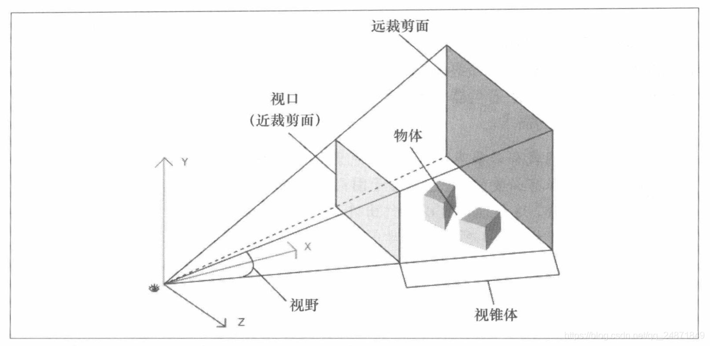
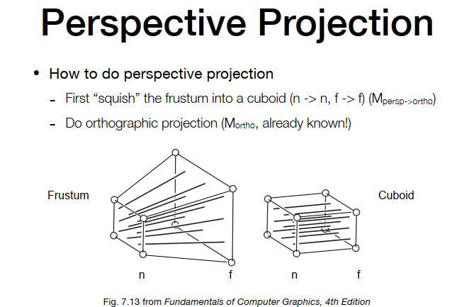
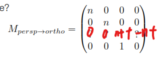

---
Type:
  - Page
aliases:
  - Transformation
tags: 
Status: 
modifiedDate: 星期三, 五月 28日 2025, 9:57:40 晚上
---

## 各类空间

•局部空间（Local Space）：

•也称为物体空间（Object Space）。

•是物体的本地坐标系，顶点和法线等信息在这个空间中定义。

•在这个空间中，物体的原点通常在物体的中心或其他特定位置。

•世界空间（World Space）：

•物体被转换到世界坐标系，这个空间是相对于世界的统一坐标系。

•通过将局部坐标乘以世界变换矩阵（通常包括平移、旋转和缩放）来实现转换。

•在世界空间中，所有物体的相对位置和方向都统一在一个全局坐标系中。

•视图空间（View Space）：

•也称为摄像机空间（Camera Space）

•物体从世界空间转换到视图空间，通过将世界坐标乘以视图变换矩阵来实现。

•这个空间是相对于摄像机的坐标系，摄像机通常位于原点并面向负z轴方向。
•裁剪空间（Clip Space）：

•在视图空间中进行透视投影，物体被转换到裁剪空间。

•通过将视图坐标乘以投影矩阵（透视投影或正交投影）来实现。

•裁剪空间的坐标的w分量不为1（？），用于后续的裁剪操作。

•归一化设备坐标（Normalized Device Coordinates, NDC）：

•裁剪空间的坐标经过透视除法（通过除w分量进行归一化）后得到NDC。

•NDC的坐标范围也是-1到1。

•这是一个标准化的空间，独立于具体的显示设备。

•屏幕空间（Screen Space）：

•NDC坐标被映射到屏幕空间，屏幕空间的坐标通常是像素坐标。

•在这个过程中，坐标范围从-1到1映射到实际的屏幕分辨率。

•这个空间中的坐标表示具体像素位置，用于最终的光栅化过程。

### 模型空间

### 世界空间

### 相机空间

以摄像机为原点建立坐标系，方便投影转换到屏幕空间  

### 裁剪空间

### 归一化设备坐标

缩放成
从-1，+1到0，1

### 像素空间、屏幕空间

**raster space**
把标准的cube按照raster成image的需求，从

按照image的尺寸拉伸成


- 屏幕范围：(0,0)到(width,height)

## 齐次坐标系

- 为什么要用齐次坐标
    - 区分向量和点，更易于表示仿射变换

## 2 维空间下变换操作


点表示

### 基本变换操作

- 平移
    - 
- 对称
- 切变
- 缩放
    - 
- 旋转
    - 
    - 旋转负角度=正角度矩阵的转置
    - 

### 复杂变换操作

*矩阵相乘的顺序是从右往左，矩阵变换的顺序应该是——缩放、旋转、平移。*
把复杂的变换转换为基本的变换
旋转要先到原点


## 3 维空间下变换操作

点表示


与二维空间类似

### 罗德里格斯旋转公式


## 各类变换

**MVP** **变换**  

[https://blog.csdn.net/ZDEWBYE/article/details/129481440](https://blog.csdn.net/ZDEWBYE/article/details/129481440)    
[[计算机图形学]MVP变换(前瞻预习/复习回顾)\_图形学wmp矩阵-CSDN博客](https://blog.csdn.net/ZDEWBYE/article/details/129481440)    

### 建模变换

model：把模型从本地坐标转换成世界坐标。  
物体在空间中的定位与变换  

### 视图变换

^413d81

把世界坐标转换成观察坐标。先把相机放到某一位置，在保持相机的方向，把相机移动到原点。  
- 向上方向  头顶方向  
- 位置方向  人头位置  
- 观察方向  人头正对着的方向  
    

视图变换即把相机移到原点，并摆正方向。需要先平移，再旋转   
所以M\_view矩阵由两个矩阵组成，平移矩阵和旋转矩阵  
平移矩阵简单，  
旋转矩阵较为复杂，故取逆矩阵简化

### 投影变换

#### 正交投影

    

    

先平移，再缩放成标准立方体  

#### 透视投影

##### 总结

**透视投影得到的实际是齐次坐标系下的点，仍需进行透视除法，得到NDC（-1，1）的点**

##### 先转为正交投影的方法

所谓视口，即可见的窗口
透视投影**就是把摄像机空间中的物体投影到-1，1的标准立方体中，（按光线传播方法，所以才有透视感）**  

不是先做透视投影，后做正交投影  

而是透视投影需要用到正交投影  

    

把平截头体压缩成立方体，再进行正交投影  

    

该矩阵把摄像机空间中的物体压缩，给其带来远近，透视的感觉，  

再利用正交投影，把此时空间中的物体转换到屏幕空间上
此时为齐次坐标系

$$
NDC_c =M_{ortho}*透视除法（即除w）*M_{persp->ortho}*Point
$$

**Point乘$M_{persp->ortho}$矩阵后，得到齐次坐标中的点（此时w分量值为z），本来需要进行透视除法，将w分量转回1，但透视除法可以之后再进行。先乘$M_{ortho}$得到标准立方体坐标，即裁剪空间坐标，但是在齐次空间中。需要进行透视除法，得到NDC坐标点。**

**透视投影得到的实际是齐次坐标系下的点，仍需进行透视除法，得到NDC（-1，1）的点**

##### 视锥角度的方法

先转为正交投影的做法如图

透视投影变换矩阵还可以用另外的一种表达方式，用`fovy`和`aspect`和距离`n`来替代
l r t b.


```cardlink
url: https://www.yuque.com/gameops/graphics/bw76u5#nwa07
title: "04 Transformation Cont. · 语雀"
description: "视频课作业无PPT:GAMES101_Lecture_..."
host: www.yuque.com
image: https://mdn.alipayobjects.com/huamei_0prmtq/afts/img/A*sRUdR543RjcAAAAAAAAAAAAADvuFAQ/original
```
