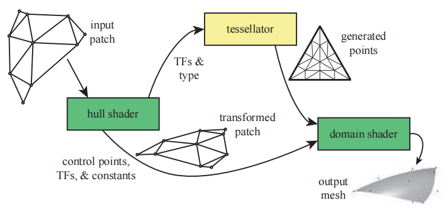

---
Type:
  - Page
aliases:
  - Hull Shader
tags: 
Status:
modifiedDate: 2025/06/20, 14:22:06
---

# 壳着色器

1. 决定每个部分的细分级别.比如，靠近肩膀的袖子可能需要更密的分割，袖口则少一些. 将这些信息发给[曲面细分器](曲面细分器.md)
2. 微调原始控制点？传递曲面细分控制参数给[域着色器](域着色器.md)
