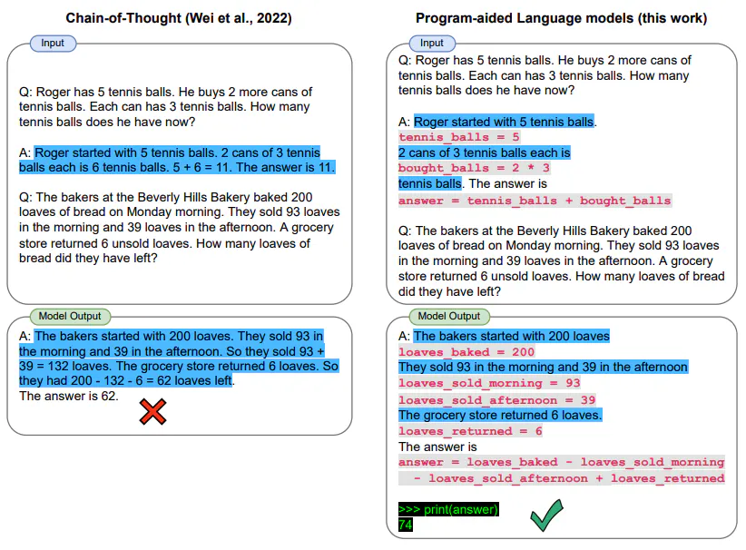

---
Type:
  - Page
aliases: 
tags: 
Status:
  - archive
modifiedDate: 星期一, 五月 26日 2025, 2:57:46 下午
---

[提示工程指南 | Prompt Engineering Guide (promptingguide.ai)](https://www.promptingguide.ai/zh)

## 常用提示技术

对当前的帮助
- 背景：rag 数据增强 图 提示词 llm
	- 推荐背景下的知识增强，需要考虑可以接受的成本代价
- 目标：利用llm及rag获取外部知识
- rag流程
	- 检索文档，如何检索，检索效果，
		- 对搜索结果的排序
		- 使用图来指定方向
		- 使用llm来给定检索方向
		- 检索关键词
		- rag检索的和模型自有的
		- 综合使用多个模型的搜索结果（有些模型不存在特定知识）但开销太大
		- 知识图谱不了解啊
	- 文档字数那么多，有效信息提炼，提高效率
- 结合因式分解提示词

### 零样本

不给出例子

### 少样本

给出少量例子

### 链式思考COT

- 通过给出例子（少样本COT）
- 或者直接在提示词中写明让模型**“逐步思考”**，即零样本COT
- Atuo-COT 
    - 
    - 从各类例子中选择有代表性的问题，使用零样本COT，得到例子
    - 把例子作为少样本COT的例子，但在本问题中需要使用类似的**“逐步思考”**

### 自我一致性

多次使用少样本 CoT生成答案，选择出现最多数的答案（最一致）
*不好用的感觉*

### 生成知识提示

分为两步：
1. 对于给定的问题，可以给出例子，先通过第一个提示词让模型生成关于问题的一些知识，
2. 然后将这些知识作为第二个提示词的一部分，输入模型，获取最后答案

>例子1
>...
>例子n
>输入：高尔夫球的一部分是试图获得比其他人更高的得分。
>知识：

>问题：高尔夫球的一部分是试图获得比其他人更高的得分。是或否？
>知识：高尔夫球的目标是以最少的杆数打完一组洞。一轮高尔夫球比赛通常包括18个洞。每个洞在标准高尔夫球场上一轮只打一次。每个杆计为一分，总杆数用于确定比赛的获胜者。
>解释和答案：

### 链式提示

将任务分解为多个子任务，多次使用不同的Prompt让LLM生成答案
确定子任务后，将子任务1的提示词提供给语言模型，得到的结果1作为新的提示词2的一部分。

### 思维树ToT

树搜索
多轮对话

>假设三位不同的专家来回答这个问题。所有专家都写下他们思考这个问题的第一个步骤，然后与大家分享。然后，所有专家都写下他们思考的下一个步骤并分享。以此类推，直到所有专家写完他们思考的所有步骤。只要大家发现有专家的步骤出错了，就让这位专家离开。请问...

问题：开销太大

### 检索增强生成 (RAG)

1. 附加组件检索问题相关文档
2. 将这些文档作为提示词的一部分输入模型以得到更好的结果

### 自动推理并使用工具 (ART)

用于解决LLM在处理复杂任务时需要手动编写程序（人工给出详细的提示词）的问题。
1. 输入问题
2. 从框架的任务库找到类似的任务
3. 使用LLM根据类似任务的提示词生成提示词
4. 使用额外工具生成当前任务的补充描述

ART 引导模型总结示范，将新任务进行拆分并在恰当的地方使用工具。

### 自动提示工程师（APE）

思想：给出不具有具体指令的例子，让LLM生成多个待选指令。选择较好的指令

**“让我们一步一步地解决这个问题，以确保我们有正确的答案。”**相比于**“让我们一步一步地思考”**更好

### Active Prompt

- 研究动机
    - 思维链可以激发LLM的推理能力，但是需要人类选择问题，再做推理和答案的标注，人工选择的示例不一定对任务最有效，而且不同的任务难度，领域等存在明显差异，人工挑选成本较高。**因此要实现自动选择示例**
    - 论文基于这点考虑，借用了主动学习范式采用不确定指标来选择最有价值的示例，再引入人工标注，主要在选择问题示例上能够降低人力成本，简单而言，就是主动学习在prompt工程方面的应用
- 框架
    - **度量阶段**：基于CoT-few-shot 或者 CoT-zero-shot方式，LLM对训练集中每个问题进行重复k次采样输出，对产生的答案计算不确定性指标，从而判断问题的好坏
    - **选择阶段**：选择不确定性指标最高（即最不可信）的问题用于后续标注
        - 为什么选择最不可信的问题？然后进行标注？**示例答案的随机或者错误影响很小，但是依然是提供正确的标签情况下效果是最佳的，何况这里专门筛选了不确信的样本，人工标注会带来增益**
    - **标注阶段**：人工参与对选择的问题进行标注，即优化问题
    - **推理阶段**：使用最新的标注示例做问题推理
- 不同
    - 原来
        1. 给定问题
        2. **人工选择示例**
        3. 人工标注，解释，完善示例
        4. 给出答案
    - 现在
        1. 给定问题
        2. **工具自动选择最有价值示例**
        3. 人工标注，解释，完善示例
        4. 给出答案

### 方向性刺激提示

在提示词中额外给出hint，即一系列小提示（关键词）
让LLM围绕hint生成回答，以有方向性的给出刺激性提示

**KAR应用提示词的方法与这个类似**

### PAL（程序辅助语言模型）

不要求LLM给出回答，而是**利用提示词以及例子**
让模型生成解决问题的Python程序，（让自然语言前都带个 \#）
使用python解释器回答数学问题？
要求LLM具有相当的逻辑能力，可这和CoT有什么区别吗？
要求LLM以程序的方式计算？
如果LLM能输出正确的程序，那它自然也能给出正确答案吗？

### ReAct框架

思想：
- 思考：让LLM生成对指定问题的类似于人类的思考步骤
- 操作：使用LLM或外部工具检索，来获取额外信息
- 观察：得到的额外信息

将一次思考得到的观察作为额外信息送入下一次思考
在一步一步中回答问题

例子

> 正在输入新代理执行器链......
> 我得查出奥利维亚·王尔德的男友是谁然后计算出他的年龄的 0.23 次方。
操作: 搜索
操作输入: “奥利维亚·王尔德的男友”
观察: 奥利维亚·王尔德与杰森·苏代基斯在多年前订婚，在他们分手后，她开始与哈里·斯泰尔斯约会 — 参照他们的关系时间线。
思考: 我需要找出哈里·斯泰尔斯的年龄。
操作: 搜索
操作输入: “哈里·斯泰尔斯的年龄”
观察: 29 岁
思考: 我需要计算 29 的 0.23 次方。
操作: 计算器
操作输入: 29^0.23
观察: 答案: 2.169459462491557
思考: 现在我知道最终答案了。
最终答案: 哈里·斯泰尔斯, 奥利维亚·王尔德的男朋友, 29 岁。他年龄的 0.23 次方是 2.169459462491557。
 > 结束链。

### Reflexion框架

- **Actor**: Actor由LLM担任，主要工作是基于当前环境生成下一步的动作。
- **Evaluator**: Evlauator主要工作是衡量Actor生成结果的质量。就像强化学习中的Reward函数对Actor的执行结果进行打分。
- **Self-reflexion**：Self-reflexion一般由LLM担任，是Reflexion框架中最重要的部分。它能结合离散的reward信号(如success/fail)、trajectory等生成具体且详细语言反馈信号，这种反馈信号会储存在**Memory**中，启发下一次实验的**Actor**执行动作。相比reward分数，这种语言反馈信号储存更丰富的信息，例如在代码生成任务中，Reward只会告诉你任务是失败还是成功，但是**Self-reflexion**会告诉你哪一步错了，错误的原因是什么等。
- **Memory**：分为短期记忆(short-term)和长期记忆(long-term)。在一次实验中的上下文称为短期记忆，多次试验中**Self-reflexion**的结果称为长期记忆。类比人类思考过程，在推理阶段Actor会不仅会利用短期记忆，还会结合长期记忆中存储的重要细节，这是Reflexion框架能取得效果的关键。

1. 问题(结合 **Memory** )
2. 答案
3. Evaluator评估结果
4. Self-reflexion 结合打分结果生成语言反馈，告诉你哪一步错了，错误的原因是什么等。存储在 **Memory** 中

### 多模态思维链提示方法

利用多模态信息，比如将图片作为提示词的一部分，获得更好结果

### GraphPrompts

图形提示框架
