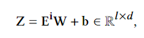

---
Type:
  - Log
aliases: 
tags: 
Status: 
modifiedDate: 星期四, 五月 29日 2025, 1:54:18 下午
---

## 结构

### 主体

网络主体llama2 7b

### AttentionFusion注意力融合层

#### 线性层

nn.Dense


#### 加性注意力机制

为什么要加？

```
self.encoder = nn.Sequential(
    nn.Linear(self.embed_dim, self.hidden_size),
    nn.Tanh(),
    nn.Linear(self.hidden_size, 1, bias=False),
)
```

## 微调

### 冻结

llama 7b共32层，冻结前30层

### 缓存？

### LoRA微调

对最后两层应用LoRA微调
**怎么做**
