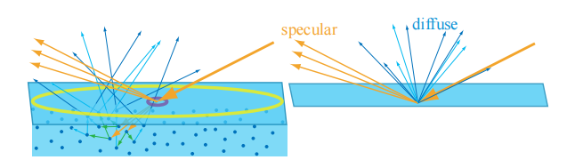

---
Type:
  - Page
aliases: 
tags: 
Status: 
modifiedDate: 星期三, 六月 4日 2025, 3:52:43 下午
---

- 黄圈和紫圈代表了两种不同的着色尺度
	- 对于黄圈, 着色尺度大于次表面散射的距离, 可以忽略这些距离, 将次表面散射项视为漫反射项. 此时使用的是***[局部着色模型](局部着色模型.md)***, 局部次表面散射
	- 对于紫圈, 着色尺度小于次表面散射的距离, 无法忽略, 需要使用**全局着色模型**, 全局次表面散射
