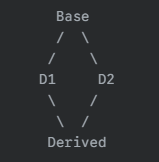

---
Type:
  - Page
aliases: 
tags: 
modifiedDate: 2025/06/13, 20:08:51
---

# 菱形继承问题

## 问题描述

- `Base` 是一个基类。
- `D1` 和 `D2` 都继承自 `Base`。
- `Derived` 同时继承自 `D1` 和 `D2`。
在这种情况下，`Derived` 类中会有 `Base` 类的**两个独立的子对象**：一个来自 `D1` 的继承路径，另一个来自 `D2` 的继承路径。

这会造成:
- **数据冗余**：如果 `Base` 类有成员数据，`Derived` 对象中将会有两份 `Base` 类的成员数据，造成内存浪费。
    - `sizeof(Derived)==sizeof(D1)+sizeof(D2)`
    - 使用虚继承后为 `sizeof(Derived)==sizeof(D1)+sizeof(D2)-sizeof(Base)`
- **语义模糊**：当通过 `Derived` 对象访问 `Base` 类的成员时，会产生歧义：应该访问哪一个 `Base` 子对象中的成员？

## 解决

使用[虚继承](虚继承.md)解决
