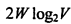
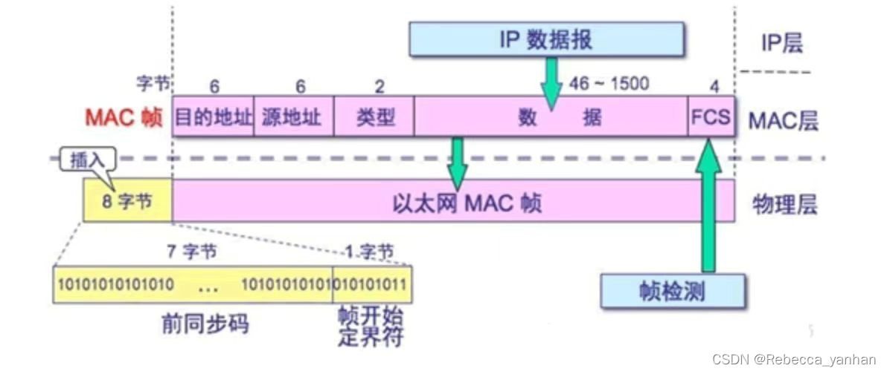
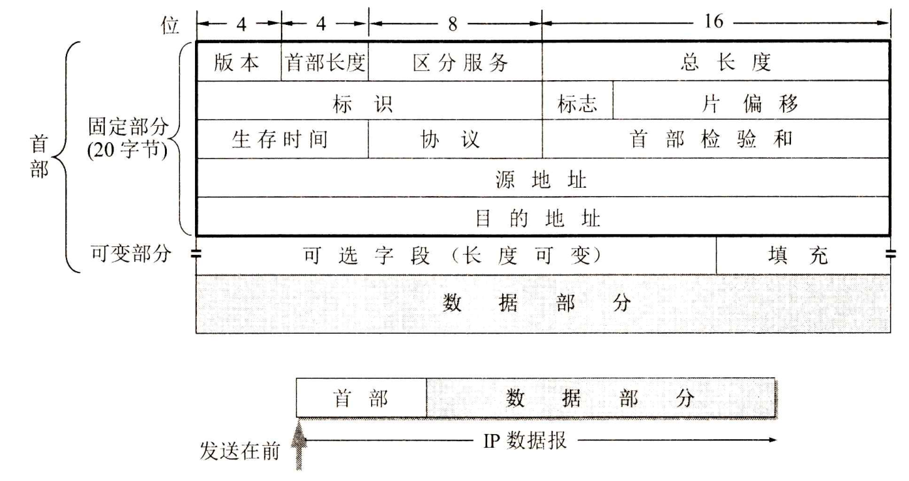

---
Type:
  - Tool
  - MOC
aliases: 
tags: 
Status: 
modifiedDate: 2025/06/18, 20:59:31
---

# 计算机网络

[计算机网络需要重新了解内容](计算机网络需要重新了解内容.md)
[计网错题](计网错题.md)

## 协议总结

[协议](https://zhuanlan.zhihu.com/p/477662535)
https://www.bilibili.com/read/cv15320987/

| 层         | 协议       |
| :-------- | -------- |
| 物理层       |          |
| 数据链路层  |          |
| 网络层       | OSPF，ARP |
| 传输层       |          |
| 应用层       | RIP      |

### 功能

- 数据链路层
    - 帧定界
    - 差错控制（检测与纠正）
    - 流量控制
- 网络层
    - 流量控制
    - 拥塞控制
- 传输层
    - 流量控制
    - 拥塞控制
[OSI中哪几层有流量控制,有什么区别?](https://zhidao.baidu.com/question/155927309.html)

## 2. 物理层

### 编码

#### 曼彻斯特

低到高表示 0

#### 差分曼彻斯特

有跳变表示 0，无跳变表示1

### 无题

信道传输速率即发送速率，与信号传播速率无关

### 香农公式

注意区分带宽和采样频率
带宽是
~~采样频率是Wlog2V~~

### 奈奎斯特

[通俗易懂奈奎斯特定理和香农定理-CSDN博客](https://blog.csdn.net/dallin0408/article/details/59510405)

## 3. 数据链路层

### CDMA、CSMA、ALOHA

[CDMA 、CSMA 、CSMA/CD、CSMA/CA傻傻分不清](https://blog.csdn.net/weixin_43889841/article/details/103562776)
[Aloha和时隙Aloha介绍与分析-CSDN博客](https://blog.csdn.net/weixin_43623428/article/details/111240701)

### 以太网帧结构

[以太网帧、IP数据报的图解格式（包含相关例题讲解，一题足够）以太网帧格式-CSDN博客](https://blog.csdn.net/weixin_45440484/article/details/129667838)

6B（目的MAC）+6（源MAC）+数据（46-1600B）+2

### CRC校验

原码经CRC模二运算，得到 （源码+CRC校验码（后面，位数=公式阶数n）），并发送
接收方对收到的数据进行模二运算，若余数为0，则正确，得到原数需要去除后n位

#### 模二运算

1-0=0
0-1=1
1-1=0
0-0=0
不借位，进位

## 网络层

[【计算机网络系列】网络层④：详解IP数据包的格式_ip数据包的类型有哪些-CSDN博客](https://blog.csdn.net/qq_37085158/article/details/128393315)
IP数据报

