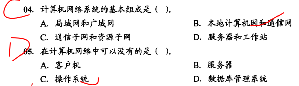
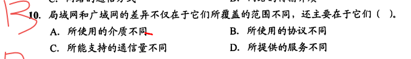
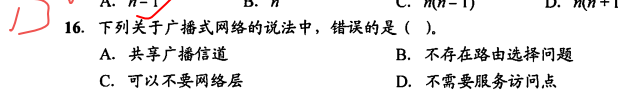
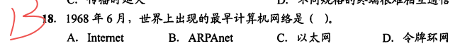
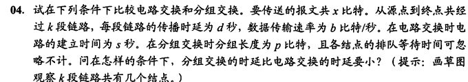
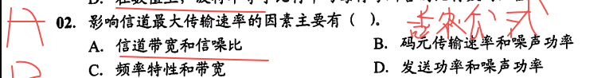

---
Type:
  - Page
aliases:
  - 计算机网络错题
tags: 
Status: 
modifiedDate: 2025/06/18, 20:59:55
---

# 计网错题

[考研复试准备](考研复试准备.md)

## 1

## 1.1

（正确的）

经典习题

k段链路：比如4条线，就有**三条链路**，只有**两个节点**
一般公式（画图以帮助理解）
$发送时延+传播时延$
$报文数*发送时延+链路数*传播时延+(链路数-1)*每个节点发送时延$

## 2.物理层

### 2.1

## 3.数据链路层
