---
Type:
  - Page
aliases: 
Status: 
tags: 
modifiedDate: 星期一, 五月 26日 2025, 8:49:28 晚上
---

- 耦合：模块之间联系强弱的度量
- UML不使用的图：数据流程图、层次图
- 信息掩蔽
    - 单入口
    - 内部数据和实现细节对调用者不可见
    - 通讯只能通过接口
- 模块尺寸太大，应**分解以提高内聚**
- H+U最小
- 数据流程图的分层表示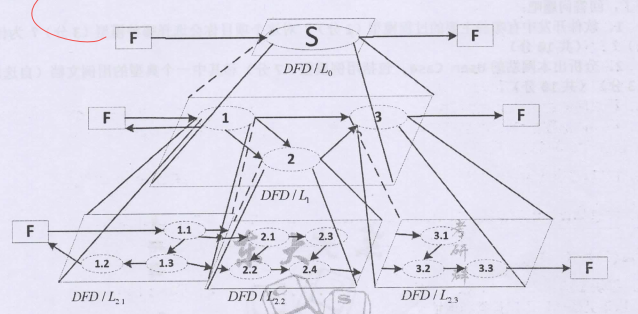
- 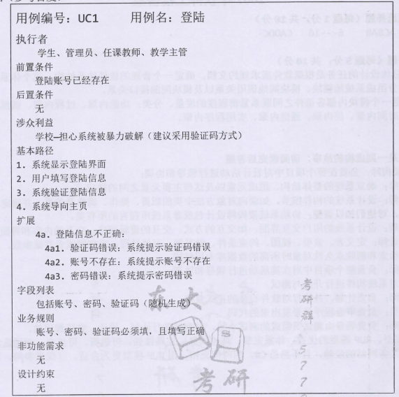
- 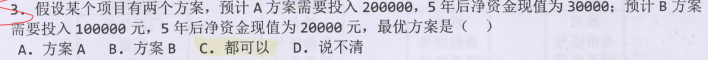
- 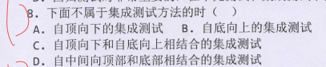
- 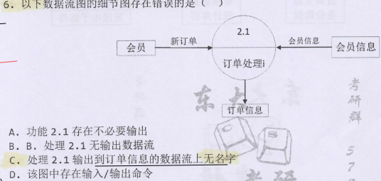
- 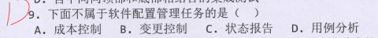
- 
- 
- 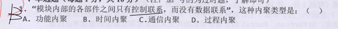
- 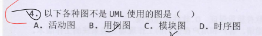
- 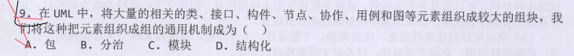
- 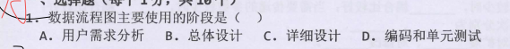
- 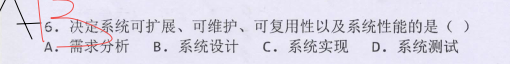
- 
- 
